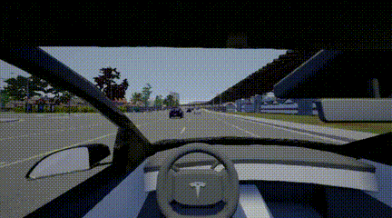

# Reinforcement-learning-based-driving-decision-in-Carla
This package includes some deep reinforcement learning based agents for self-driving-car in CARLA.

## Requirement
```
opencv-python == 4.1.1.26
pytorch == 1.3.0
CARLA == 0.9.5
```

## Scenario-I (ObstacleAvoidance-v0)
This scenario will randomly place some static vehicles in a straight-lane. The agent should drive safely without any collision and lane-invasion (solid) behavior.
The following script gives you an example of training an agent in this scenario.
```
python results/obstacle_avoidance_carla.py
```

The following script shows how to visualize the agent behavior after training.
```
python environments\carla_enviroments\test_env_v1_ObstacleAvoidance.py
```

The following animation show the agent behavior in this scenario.  


## Scenario-II (ObstacleAvoidance-v2)
A dynamic traffic. Some vehicles are randomly placed in a straight-lane, and are set as autopilot mode. The agent should drive safely without any collision and lane-invasion (solid) behavior.  
We suggest you train the agent at static traffic at first and resume the model at this scenario, it will accelerate the network convergence.The following script gives you an example of training an agent in this scenario.
```
setting the env_title = "ObstacleAvoidance-v2" in obstacle_avoidance_carla.py, and then
python results/obstacle_avoidance_carla.py
```

The following animation show the agent behavior in this scenario.  

