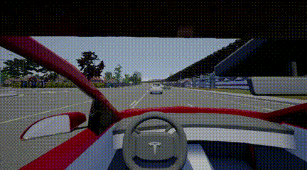

# RL-based-decision-making-in-Carla
This package includes some deep reinforcement learning based agents for self-driving-car in CARLA.

## Requirement
```
opencv-python == 4.1.1.26
pytorch == 1.3.0
CARLA == 0.9.5
```

## Scenario-I (ObstacleAvoidance-v0)
This scenario will randomly place some static vehicles in a straight-lane. The agent should drive safely without any collision and lane-invasion (solid) behavior.
The following script gives you an example of training an agent in this scenario.
```
python results/obstacle_avoidance_carla.py
```

The following script shows how to visualize the agent behavior after training.
```
python environments\carla_enviroments\test_env_v1_ObstacleAvoidance.py
```

The following animation show the agent behavior in this scenario.  


## Scenario-II (ObstacleAvoidance-v1)
A dynamic traffic. (todo)
